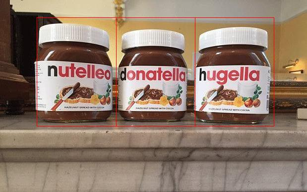
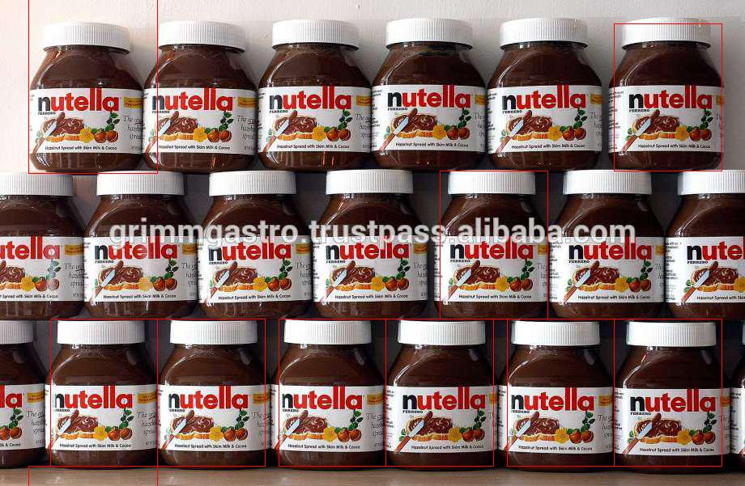
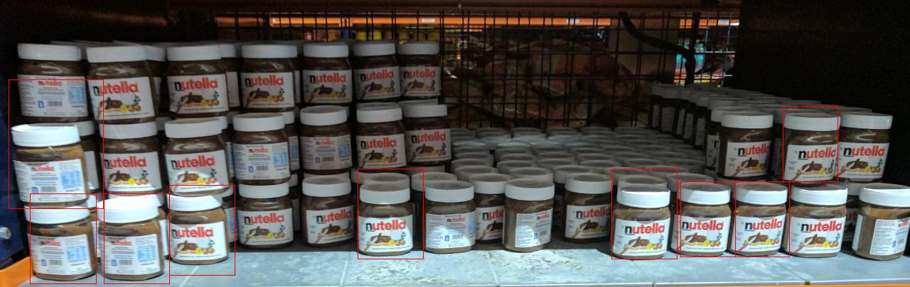

# The Shelf Detector System For Retail Stores Using Object Detection

### Automatic Stock Replenishment

Shelf-out-of-stock is one of the leading motivations of technology innovation in the shelf of the future. Traditionally, for Stock Replenishment visual check of shelves is performed by human employees, a task known as planogram compliance monitoring. Using image recognition technologies, in-store cameras can automatically recognize items on shelves, and assist humans in this tedious process.


Automatic item recognition also helps for omnichannel retail strategies: with real-time shelf monitoring, the store can be used as a warehouse for online orders. 

This innovation matters because it takes human error and processing scalability out of the equation. When you are selling billions of products around the world, even a small percentage of variance has a significant impact. 

Image Recognition Identify void spaces on the shelf and accurately detect and count front-facing products at category, range, brand or SKU level. 

It has the immense potential to solve the problem of shelf optimisation, reduce data capture time, measure in-store execution quality of merchandisers in real-time and more importantly, help the same merchandisers correct their mistakes while they are still at the store. 

*Value: inventory distortion costs globally nearly $1.1 Trillion. On average, each store could increase sales by 7.5 percent, if it could completely fix this problem.*

### The Setup

Image of the shelf can be captured via Surviliance camera and real-time reports can be pushed into the POS (Point of Sale) of merchandiser within few minutes of the data capture. These reports can cover critical areas like shelf share, market operating price of self and competition, scores of stores, out of stock incidence of core SKUs as well as POSMs.

It can help automatically recognizes products from standard images taken in-store at scale, with high precision and fast detection results. 

It can help find logos and identify individual product and their types for even greater business value.



### The Proof Of Concept

For the POC we took image examples of Nutella Jars kept on shelf from google and trained out program with 10 images. The example shows how to dlib to perform object detector for semi-rigid object.  In particular, we go though the steps to train the kind of sliding window object detector first published by Dalal and Triggs in 2005 in the paper Histograms of Oriented Gradients for Human Detection.




### DLIB

Dlib is a modern C++ toolkit containing machine learning algorithms and tools for creating complex software in C++. It is used in both industry and academia in a wide range of domains including robotics, embedded devices,mobile phones, and large high performance computing environments.

Dlib is a collection of useful tools, it is dominated by machine learning. In particular, the face detection, landmarking, and recognition example programs are now probably the most popular parts of dlib which are ported to python as well and a very good entry point to test and experience object detection. It has also been ported to Android as well.

It has some good Machine Learning alogithms for image classification and detection. Some of its key features to computer vision are. 

- Routines for reading and writing common image formats.
- Automatic color space conversion between various pixel types
- Common image operations such as edge finding and morphological operations
- Implementations of the SURF, HOG, and FHOG feature extraction algorithms.
- Tools for detecting objects in images including frontal face detection and object pose estimation.
- High quality face recognition and also works with OpenCV

It is because of its easy and usable features for object detection & image countring that I have chosen it for this current use case.


### How to run the Code

First install the requirements.

```
pip install -r requirements.txt
```
**Note**: If you face issues in installing dlib. I suggest to refer to dlib documentation for further help on installation.

Then to run the demo please run the following command:

```
python train_obj_detector.py testNutella1
```
Ideally if everything runs smoothly, you should be able to see the window showing the image detector window and the window showing images where nutella is getting detected and the counts in the commandline.

[Demo video link](https://drive.google.com/file/d/0B_6-Nafd8mwNTXZiQVZhWFRCS2c/view?usp=sharing&resourcekey=0-1y-ROgy1vmVEKYePH8Hg3A)


### Conclusion



Unlike other object detectors in OpenCV or other libraries the number of training images used in dlib were less and still teh results were good, depending on the quality of image and number of objects and other considerations like blurring and object placement we got nutella jar detected in almost 88% of images and in almost 70% of the images where jars where detected the number of jars detected was good. And we got these results despite the fact that the images used for training and testing were diverse and did not represent the same environment. The good aprt of Dlib library is that it can even run on small devices like Android phones and even Rapsberry Pis which makes object detection solutions on dlib handy and usable.

Reference:

1. [Automated Replenishment | CribMaster](http://www.cribmaster.com/applications/lean-manufacturing/automated-replenishment)
2. [Automatic Replenishment System | RELEX Solutions](https://www.relexsolutions.com/automatic-replenishment-software/)
3. [LogoGrab are the leaders in logo recognition technology – LogoGrab](https://www.logograb.com/products/retail-intelligence/)
4. [Why image recognition is a game changer in retail](https://www.enterpriseinnovation.net/article/why-image-recognition-game-changer-retail-1646945385)
5. [dit &amp; Image Recognition](http://www.retail-scan.com/shelf-optimization.html)
6. [How retailers can eliminate checkout, like Amazon Go. And increase profits in the process.](https://medium.com/@mostafab/how-retailers-can-eliminate-checkout-like-amazon-go-one-camera-at-a-time-e4e1137c70a1
)
7. [dlib C++ Library](http://dlib.net)

